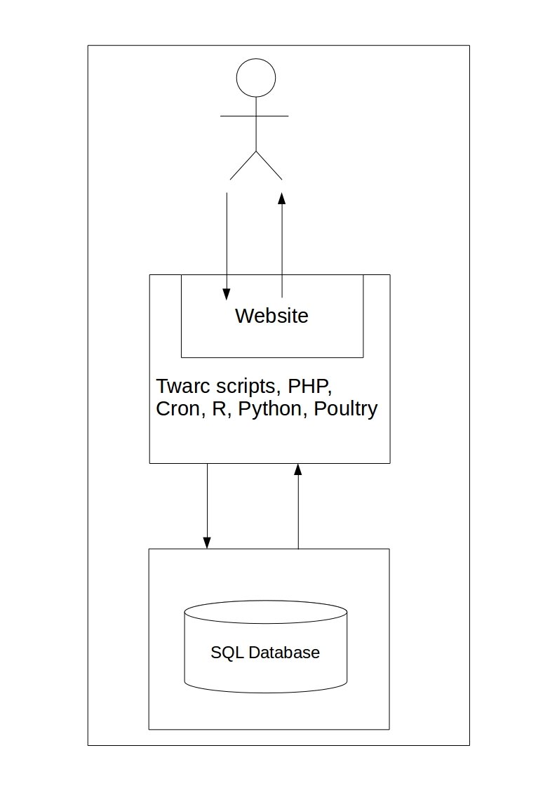
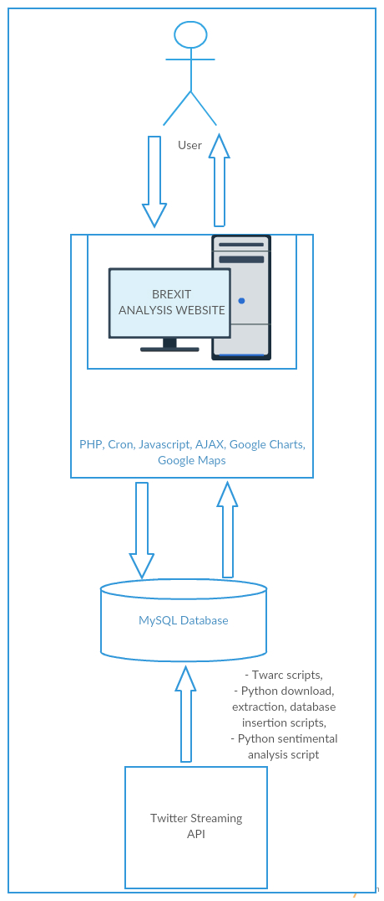
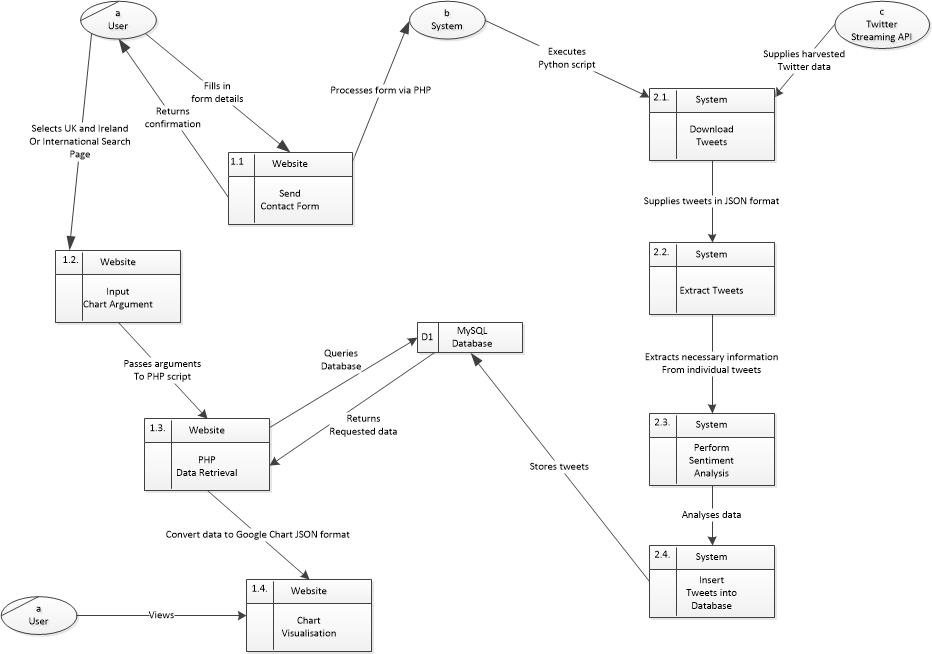

# Technical Manual
Table of Contents
=================
   * [1. Introduction](#1-introduction)
     * [1.1. Overview](#11-overview)
     * [1.2. Glossary](#12-glossary)
   * [2. System Architecture](#2-system-architecture)
     * [2.1. Website](#21-website)
     * [2.2. Web Server](#22-web-server)
     * [2.3. Twitter Streaming API and the MySQL Database](#23-twitter-streaming-api-and-the-mysql-database)
     * [2.4. MySQL Database](#24-mysql-database)
   * [3. High-Level Design](#3-high-level-design)
     * [3.1. Data Flow Diagram](#31-data-flow-diagram)
       * [3.1.1. System](#311-system)
       * [3.1.2. Twitter Streaming API](#312-twitter-streaming-api)
   * [4. Problems and Resolution](#4-problems-and-resolution)
     * [4.1. Twitter Geolocation Unavailable](#41-twitter-geolocation-unavailable)
     * [4.2. Google Maps Delay](#42-google-maps-delay)
     * [4.3. Large Dataset](#43-large-dataset)
     * [4.4. Different Formats of Tweet Data](#44-different-formats-of-tweet-data)
     * [4.5. Server Accessibility and Issues](#45-server-accessibility-and-issues)
     * [4.6. Twitter Rate Limiting](#46-twitter-rate-limiting)
   * [5. Installation Guide](#5-installation-guide)
     * [5.1. Webserver Setup](#51-webserver-setup)
     * [5.2. Setup of Dependencies Needed for Software](52-setup-of-dependencies-needed-for-software)
     * [5.3. MySQL Database](#52-mysql-database)
     * [5.4. Extract Software](#53-extract-software)

### 1. Introduction

#### 1.1. Overview
The system that we developed as part of our project, ‘Mining Twitter Data’ ultimately resulted in ‘Brexit Analysis’ -  a system comprised of a front-end web-based user interface and a back-end database and webserver. 
Its ultimate goal is to showcase the relationship between the location in which a tweet is posted and its content.
 

We chose the control topic of Brexit as it is an unprecedented event due to the fact that the UK is the first country to ever opt to leave the European Union by popular vote. 
We believe that this topic is more than suitable to showcase the differences in online opinion of the vote from not only within the various regions of the UK but that of around the globe.
 

Users can query the total percentage of tweets whose content focuses solely on the 2016 Brexit Referendum and its aftermath per country, per the sentimental value of the text itself (i.e. – positive, negative, or neutral sentiment) and by political stance- namely that of Pro-Brexit or Anti-Brexit opinion as surmised by the tweet hashtag.

##### 1.1.1. Front-End Development
The user interface or website in this particular case is hosted on the domain, www.brexitanalysis.tk, and was designed using HTML5, CSS3, Javascript, jQuery, Ajax. The website's structure was designed in HTML5 with CSS3 used to provide the appropriate stylings. 
Google Charts provided further functionality to the user experience by allowing users to view the total amount of tweets as per their specified parameters visually via a range of charts such as pie-charts, bar-charts, line-charts, etc.
 

These parameters were supplied to the Google Chart instance via JSON and loaded on the page through Ajax. Google Maps also allowed users to view the total amount of Brexit related tweets per country on a global scale.

##### 1.1.2. Back-End Developement
The back-end development of Brexit Analysis is composed of a MySQL database, a Bag-of-Words sentiment analysis algorithm written in Python and a  number of PHP scripts which allow for the user to pass their chosen arguments to the database via a HTML form. The extraction and downloading of the tweets from Dmitrijs Milajevs' online published dataset (http://www.eecs.qmul.ac.uk/~dm303/brexit/) was carried out via Python scripts and a Python library designed for the downloading and archiving tweets en masse, Twarc (https://github.com/DocNow/twarc).

#### 1.2. Glossary
##### *_API_*
'Application Programming Interface', a set of subroutines, tools and protocols which act as the fundamental building blocks for developing an application.

##### *_Apache Web Server_*
The Apache Web Server is one of the most commonly used web servers designed to host one or more HTTP websites that each belong to a unique domain name or URL.

##### *_AJAX_*
‘Asynchronous Javascript and XML’,  allows for the updating of web pages without the need to refresh or reload and allows for data to be sent to and from a server behind the scenes.

##### *_Bag-of-Words_*
This model is used in Natural Language Processing (NLP) as a means of document classification and for the analysis of the sentiment of a piece of text. The words are represented via a set counting the most commonly used words in said piece of text.

##### *_Cron_*
A time-based scheduler within Unix-based operating systems such as Linux, Ubuntu, etc.
Cron can be used to schedule commands or scripts to be run at specific times or in intervals.

##### *_CSS_*
‘Cascading Style Sheets’, allows for HTML elements to be displayed on screen in a styled manner. The latest version is CSS3.

##### *_HTML_*
‘Hyper Text Markup Language’,  used as means of creating the basic structure of web pages online. The latest version is HTML5

##### *_Google Charts_*
A  web-based API provided by Google that allows users to create graphs via user-input data and parameters.

##### *_Javascript_*
A programming language aimed at web-based applications that allows for the dynamic update of content and media.

##### *_JSON_*
‘Javascript Object Notation’, allows for information to be stored in a collection which can be easily accessed and read by humans.

##### *_jQuery_*
A Javascript library which allows for the manipulation of web-based elements and events such as the clicking of mouse buttons, etc. Works in conjunction with Javascript and AJAX.

##### *_mySQL_*
An open-source SQL database management system which utilises SQL in order to insert, update, delete, retrieve and create database entries.

##### *_NTLK_*
‘Natural Language Toolkit’, a collection of Python libraries focusing on Natural Language Processing or the study of classifying human language via text.

##### *_PHP_*
‘Hypertext Preprocessor’, an open source server scripting language that allows for data to be sent to and from the server.

##### *_Python_*
An object-oriented programming language used to create various programs and applications with a user interface.

##### *_Sentimental Analysis_*
A discipline of Natural Language Processing, sentimental analysis is often used to determine if a piece of text is positive, negative or neutral.

##### *_SQL_*
'Structured Query Language', a programming language designed to be used with a database management system in order to read and retrieve information.

##### *_Twarc_*
A command-line Python library that allows for Twitter JSON data to be archived.

##### *_UI_*
‘User Interface’,  the features of an application that allow users to use its functionality. Ideally should simple to learn and easy to use.

### 2. System Architecture
The final design of the system architecture as a whole shares the same core structure to that of the initial system architecture described in the Functional Specification. 

The two are compared below: 
###### Fig. 1. The Initial System Architecture Design

###### Fig. 2. The Final System Architecture Design

#### 2.1. Website
In our initial system architectural design, the goal of using the website as a means of user engagement and interaction was carried over to the end design. We ultimately decided to forego the usage of Django as we felt that it would impede our learning progress by essentially allowing us to _'plug in functionality'_ as opposed to actually implementing it ourselves.

The website is designed via a mixture of HTML5, CSS3, Javascript, jQuery, AJAX and PHP which allows for the retrieval of data from the back-end database. 
For extra functionality, we settled on using the Google Charts API as the primary method of presenting the retrieved data visually to users via a selection of graphical charts.
The Google Charts API also allows for the computation of the data results to be dynamically updated via jQuery and AJAX.

#### 2.2. Web Server
As most of the computation required for the charts is completed via the Google Charts API, the web server focuses mainly on the downloading, extraction of viable Twitter data in a JSON format, performing sentimental analysis and finally insertion of the gathered data into our database to be queried by users.

Following the initial design of the system architecture, Cron is used to run scripts and commands at scheduled times. 
PHP allows for the retrieval of data from the database once user parameters have been selected and submitted via the HTML form on the website tweet search page(s).
This data is then loaded to a Google Chart instance via AJAX and jQuery.
 
The Google Charts API provides extra functionality via Javascript and allows users to hover over the charts in order to view the total number of tweets relating to their search choice in closer detail on the graph. 
Google Maps allows for users to view the total amount of tweets relating to Brexit per country with such data retrieved from the database via a separate PHP script which is then converted to a JSON format.

#### 2.3. Twitter Streaming API and the MySQL Database
Twarc is be used to download tweets within the constraints of the Twitter Streaming API Rate Limit and a Python script extracts the data necessary for our system - mainly that of the tweet text, the username, location (if provided), hashtags, mentions, date of posting and the language in which the tweet is written.
 

In contrast to our initial system architecture design, we decided not to utilise the Python library, Poultry, as a means of filtering the tweet data - preferring to do it ourselves in order to make the most of the learning process provided by this project.
 

Another Python script then takes the text of each individual downloaded tweets and runs a rudimentary Bag-of-Words sentiment analysis algorithm on it to determine the sentiment of the text (i.e. if it is positive, negative or neutral) by comparing it against four text files which acts our dictionaries. 
These files contain a list of words with positive connotations, one with a list of words with negative connotations, one with a list of Unicode-converted positive emojis and finally one with a list of Unicode-converted negative emojis.
 

Once proper extraction and analysis has been completed, the tweets are then inserted into the database by means of another Python script.

#### 2.4. MySQL Database
Similarly to the initial design, a MySQL database is where we store our extracted and analyzed tweets. A mixture of Python and PHP inserts, selects and creates tables and elements from tables. Currently the database holds 142,677 tweets- excluding those of Dmitrijs Milajevs' published dataset. The database contains information such as tweet content, location, sentiment and stance amongst other data, such as username and date of publication.

### 3. High-Level Design

#### 3.1. Data Flow Diagram

The Data Flow Diagram or DFD allows us to showcase the flow of data within the system.
 
 
**Fig. 3. Data Flow Diagram**

The following entities will be explained:
- System
- Twitter Streaming API

##### 3.1.1 System
The system in question refers the back-end system of the project which is comprised of a series of Python and PHP scripts. 
These scripts allow for tweets to be downloaded, extracted, to have their sentiment determined and to be ultimately inserted into the database.

##### 3.1.2. Twitter Streaming API
The Twitter Streaming API allows our system to gain access to a real-time feed of tweets being posted to Twitter. 
This API requires a steady HTTP connection in order to successfully supply tweets within its rate limit of approximately 10 - 15 minutes.

### 4. Problems and Resolution
Throughout the duration of the project, we encountered a number of issues and problems. 
However, we dealt with this issues accordingly and to the best of our ability and as such appropriate solutions and workarounds were put in place.

#### 4.1. Twitter Geolocation Unavailable
The twitter geolocation is not disabled or deprecated and as a result when we initially began our research - it appeared that we would not face any major issues with regards to retrieving the co-ordinates of the tweet's origin or location once posted to the social media platform, Twitter.
However when we began downloading the data, we found that a small percentage of tweets contained coordinates with geolocation enabled.
 

Further research showed that although geolocation is not deprecated, it has become all but unavailable. From our attempts to check for geolocation within tweets, typically 1 in 2000 tweets contained coordinates. This was not sufficient for our purposes. 
To solve this, we opted to use the Twitter account location of the user who sent the tweet instead. 
The issue with this is that the user has the freedom to set this location and hence is no standardisation for the syntax of the location:
 
 E.g. A location could be set to “england, UK” or “london, ENG, Uk”.
 

 In order to standardise this, we incorporated a string matching algorithm to match the user’s set location to countries and cities. The algorithm ensure that only locations that matched these countries and cities were accepted. 
 We will admit that the new method is not ideal but it produces a valid location 0.17% of the time as tested by our 142,677 total tweets.

#### 4.2. Google Maps Delay
We developed a script to show number of tweets by country on a world map using Google Maps. 
Upon testing the script we have found that the length of time that it takes to load the map is too long - the delay ranges from 40 - 60 seconds.
This is a result of the design structure of the Google Maps API - i.e. it becomes slower when  it takes in parameters as country names rather than specific co-ordinates.
 

However, we devised a workaround where we convert the location to its respective geolocation within a script once having pulled the name of the location from the database.

#### 4.3. Large Dataset
The dataset provided by Dmitrijs Milajev is quite large and contains up to 300 megabytes worth of tweet IDs. 

Using this file to perform the download, extraction, analysis and finally insertion into the database was not possible due to a number reasons:
- Twitter rate limiting meant that we could not continuously download tweets without experiencing a major slowdown in productivity.
- If the process needed to be restarted, the previous batch of tweets downloaded in the last attempt prior to the restart would be re-downloaded before a new batch could begin to download.
 

To solve this issue, we created a script to manage the process of splitting the file into smaller files. This then manages which files of tweet data are to be extracted, analysed or to be inserted into the database.

#### 4.4. Different Formats of Tweet Data
The format in which tweets are downloaded via a JSON format. 
We developed an extraction script to extract the necessary data from the JSON files once downloaded via the terminal using Twarc. 
However, the format was different for both for downloading tweets via a script and for live tweet downloads.
 

This meant that we had to alter the extraction software.

#### 4.5. Server Accessibility and Issues
We set up the dedicated server at Sarah’s home as she had a stable internet connection. 
As a result, accessing the server to work on various aspects of the project would be difficult for Renatas. 
To overcome this, we set up remote access software so that Renatas could work remotely.
 

The machine on which the server was running began to overheat once we began filling the database with tweets due to the high workload for the CPU. 
To avoid this, we reduced the workload by no longer running several processes to download, extract, analyse and insert tweets into the database instead opting for a single process to run at each time. 

We also moved the machine to a cooler room to help with the overheating.

#### 4.6. Twitter Rate Limiting
The Twitter API only allows you download so many tweets before it applies a timeout. 
This was a constant constraint for us as it prevented us from building up a bigger database from the current time. 
The rate limit is much higher before the timeout occurs when hydrating tweets as opposed to standard downloading of tweets. 
This led to our database containing many more tweets from Dmitrijs Milajev’s dataset than our own collected tweets.

### 5. Installation Guide
This guide will assume that potential users have intermediate experience with regards to operating systems and the programming languages, Python, PHP and SQL. 
The operating system used when designing this system was Ubuntu version 16.04.

#### 5.1. Webserver Setup
To install software a machine capable of running a web server and a router capable of port forwarding are needed. The operating system Ubuntu or any other Unix operating system will be needed to run the software.
 

Internet access is also needed for the installation of this software suite. 
To begin, install Apache2 software on the Linux operating system. Set up and configure the firewall for Apache2. 
Next, install PHP version 7 on the server. PHP will be needed for the retrieval of data from the database, and forwarding that data to the website. 
Enable port forwarding on the router, see network provider and router details to get the instructions to do this.

#### 5.2. Setup of Dependencies Needed for Software
Next, install the latest stable version of Python, ideally Python 2.7, as it will be needed to run the scripts for downloading and extracting tweets, performing sentimental analysis and inserting tweets into the database.
 

NLTK packages (see www.nltk.org) are needed for the sentimental analysis scripts to execute as the script itself imports the _‘Stopwords’_ function from the _‘ntlk.corpus’_ library.  
 

First, install NLTK then enter the command “python” into the terminal.  Import NLTK and call the method nltk.download() to download the necessary packages for the sentimental analysis script to work.
 
Next, install the langdetect package which is needed for language detection during the extraction of tweets (see https://pypi.python.org/pypi/langdetect?). 
Twarc is a package for python which helps download tweets, install the Twarc package next (see https://github.com/DocNow/twarc).

#### 5.3. MySQL Database
A MySQL database is needed to store the tweets which will be queried by the website. 
Install the MySQL database. Import schema named “Tweets.sql” into the database. 
Create user “tweet_sys” with the password “admin_pass”. Give all privileges to this user on the dataset “Tweets”.

#### 5.4. Extract Software
Extract the contents of the folder “Mining Data” into the directory you wish to run scripts which will download, extract, analyse and insert tweets into the database.
 

Extract the contents of folder “Website” into the Apache directory for serving web content. 
Install Cron, software used to schedule processes to run. 
Create cron jobs to run the software at desired times. 
Finally place the list of strings which should be present in the tweets to download inside the tags file.
